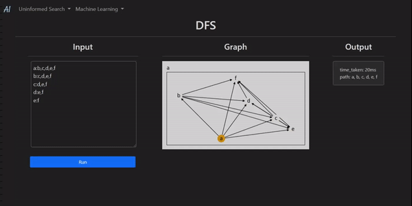
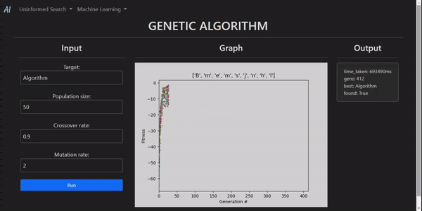

<h1 align="center"> AIVis </h1>

An app built with Django+Matplotlib to visualize different AI algorithms

## Why
I learnt a lot of algorithms from assignments and labs in my Artificial Intelligence course, so I put them all together as a webapp to learn `Django` and practice using `matplotlib` and Python in general.
## Install

`pip install -r requirements.txt`

## Run Development Server
`python manage.py runserver`

